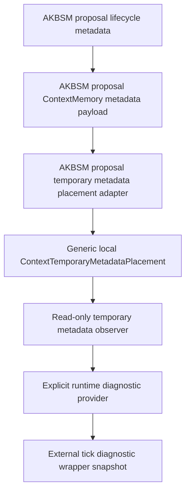
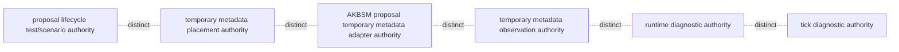
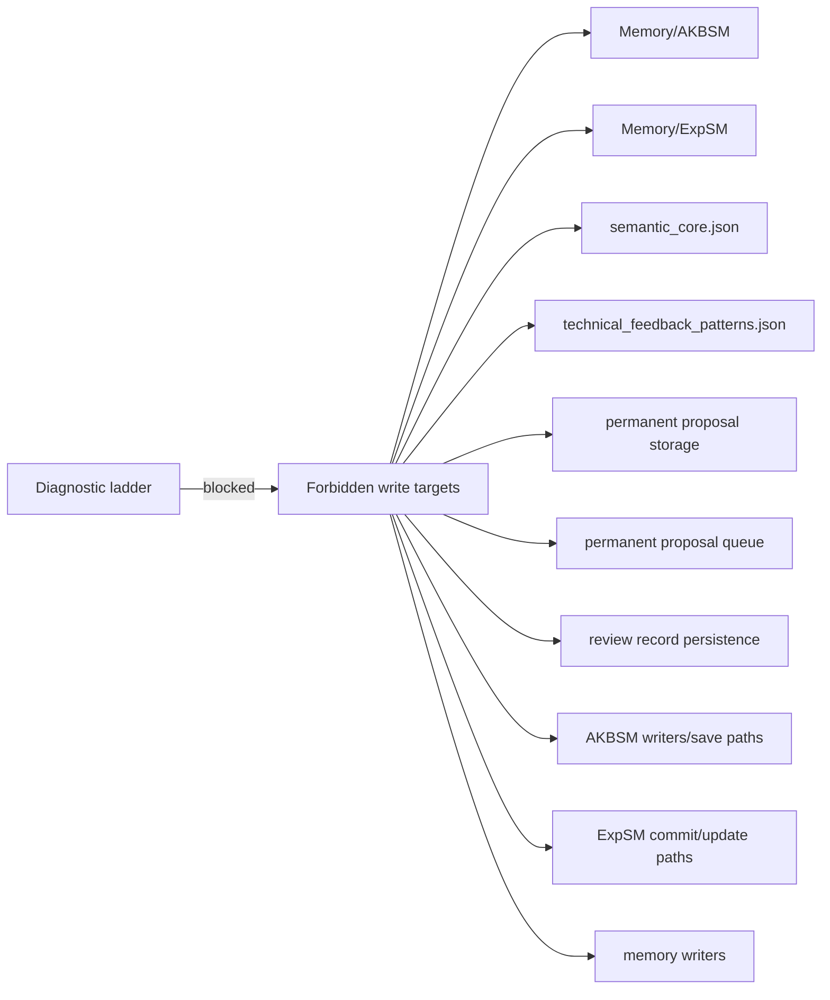
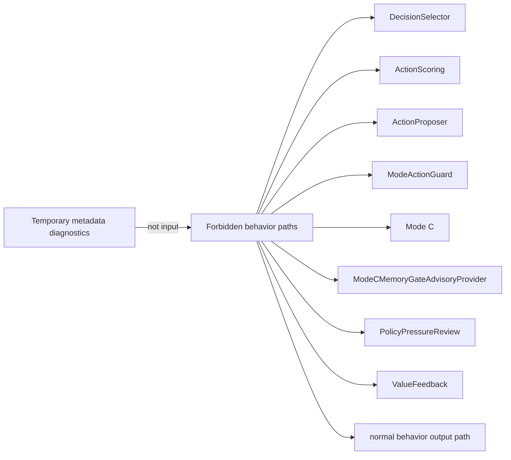
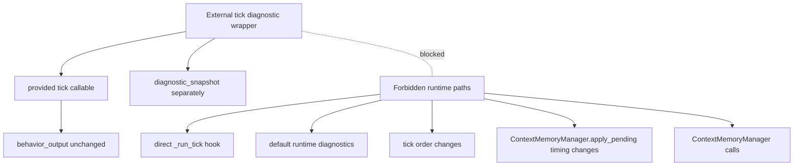

# ContextMemory Temporary Metadata Architecture Diagram

## Status

This document is a visualization/checkpoint only.

It does not introduce new runtime behavior.
It does not authorize `_run_tick()` wiring.
It does not authorize real ContextMemory reads/writes.
It does not authorize proposal storage.
It does not authorize AKBSM/ExpSM writes.
It does not authorize behavior/scoring/guard influence.

## Scope

This diagram visualizes the current temporary metadata / AKBSM proposal
diagnostic ladder described in
`docs/contextmemory_temporary_metadata_architecture_map.md`. It covers the
local/scaffold-only path up to the external tick diagnostic wrapper checkpoint
and the post-`v0.7.0` hardening coverage. It is not a runtime design approval.

## How to read this diagram

Arrows show allowed metadata/diagnostic flow under explicit test or diagnostic
authority. Red-list sections show forbidden paths. A box appearing in a diagram
does not mean the box is normal runtime default behavior, `_run_tick()` wiring,
real ContextMemory storage, AKBSM write approval, or behavior influence.

## Main component ladder



Component annotations:

| Component | Authority required | Runtime-wired | Touches `_run_tick()` | Can authorize writes | Creates permanent storage |
| --- | --- | --- | --- | --- | --- |
| AKBSM proposal lifecycle metadata | proposal lifecycle test/scenario authority | no | no | no | no |
| AKBSM proposal ContextMemory metadata payload | explicit scenario/test authority | no | no | no | no |
| AKBSM proposal temporary metadata placement adapter | adapter scenario/test authority plus TTL/expiration | no | no | no | no |
| Generic local `ContextTemporaryMetadataPlacement` | temporary metadata placement authority | no | no | no | no |
| Read-only temporary metadata observer | temporary metadata observation authority | no | no | no | no |
| Explicit runtime diagnostic provider | runtime diagnostic authority | no | no | no | no |
| External tick diagnostic wrapper snapshot | tick diagnostic authority | no | no | no | no |

## Data flow diagram

```text
AKBSM proposal lifecycle metadata
-> AKBSM proposal ContextMemory metadata payload
-> AKBSM proposal temporary metadata placement adapter
-> generic local ContextTemporaryMetadataPlacement
-> read-only observer
-> explicit runtime diagnostic provider
-> external tick diagnostic wrapper snapshot
```

The same flow, in the requested visual notation:

```text
AKBSM proposal lifecycle metadata
→ AKBSM proposal ContextMemory metadata payload
→ AKBSM proposal temporary metadata placement adapter
→ generic local ContextTemporaryMetadataPlacement
→ read-only observer
→ explicit runtime diagnostic provider
→ external tick diagnostic wrapper snapshot
```

This flow is:

- local/scaffold-only
- explicit-authority-only
- metadata-only
- read-only after placement
- not normal runtime default
- not `_run_tick()` wiring
- not behavior input
- not scoring input
- not guard input
- not write authority
- not permanent storage

## Authority separation diagram



Separation rules:

- placement authority is not observation authority
- observation authority is not runtime diagnostic authority unless explicitly documented
- runtime diagnostic authority is not tick diagnostic authority unless explicitly documented
- tick diagnostic authority is not placement authority
- no authority in this ladder is AKBSM write authority
- no authority in this ladder is ExpSM write authority
- no authority in this ladder is behavior influence authority

## No-write boundary diagram



No-write rules:

- ContextMemory metadata presence is not AKBSM write approval.
- temporary placement result is not storage approval.
- observation result is not write approval.
- runtime diagnostic report is not write approval.
- tick diagnostic snapshot is not write approval.
- accepted_for_observation remains observation-only.
- deferred is not pending commit.
- rejected metadata cannot authorize writes.
- expired metadata cannot authorize writes.
- proposal.commit_allowed remains False.
- AKBSM writes remain blocked.

## No-behavior-influence boundary diagram



Diagnostics are not input to these paths. They do not influence behavior,
scoring, guards, Mode C, `ModeCMemoryGateAdvisoryProvider`,
`PolicyPressureReview`, `ValueFeedback`, or the normal behavior output path.

## Runtime / _run_tick boundary diagram



External tick diagnostic wrapper:

- accepts provided tick callable
- does not import `CLCRuntime`
- does not call `CLCRuntime._run_tick` directly
- returns `behavior_output` unchanged
- returns `diagnostic_snapshot` separately

Forbidden:

- direct `_run_tick()` hook
- default runtime diagnostics
- tick order changes
- `ContextMemoryManager.apply_pending()` timing changes
- `ContextMemoryManager` calls

Direct `_run_tick()` diagnostic hook remains deferred.
Any future direct `_run_tick()` hook requires a separate ADR/pass.

## Safe stopping point

Current safe stopping point: explicit/local/scaffold-only diagnostics up to an
external tick wrapper.

This allows diagnostic snapshots around a provided callable without normal
runtime wiring or `_run_tick()` modification.

Stopping here preserves maximum safety before any direct runtime/tick
integration.

## Forbidden paths

- no direct `_run_tick()` hook without separate ADR and verifier plan
- no default runtime diagnostic activation
- no real ContextMemory reads/writes without separate ADR
- no proposal storage or queues without separate ADR
- no AKBSM writes without separate ADR, gates, rollback, scenarios, and memory mutation policy update
- no behavior/scoring/guard influence without separate behavior influence ADR and no-behavior regression plan
- no Mode C/PolicyPressureReview connection from this subsystem

## Related documents

- `docs/contextmemory_temporary_metadata_architecture_map.md`
- `docs/v1_readiness_criteria.md`
- `docs/adr_contextmemory_temporary_metadata_tick_diagnostic_visibility.md`
- `docs/adr_contextmemory_temporary_metadata_diagnostic_wiring.md`
- `docs/adr_contextmemory_temporary_metadata_runtime_observation.md`
- `docs/adr_contextmemory_temporary_metadata_placement_api.md`
- `docs/adr_akbsm_proposal_contextmemory_metadata_integration.md`
- `docs/current_architecture_checkpoint.md`
- `docs/post_v0_0_2_safety_architecture_checkpoint.md`
